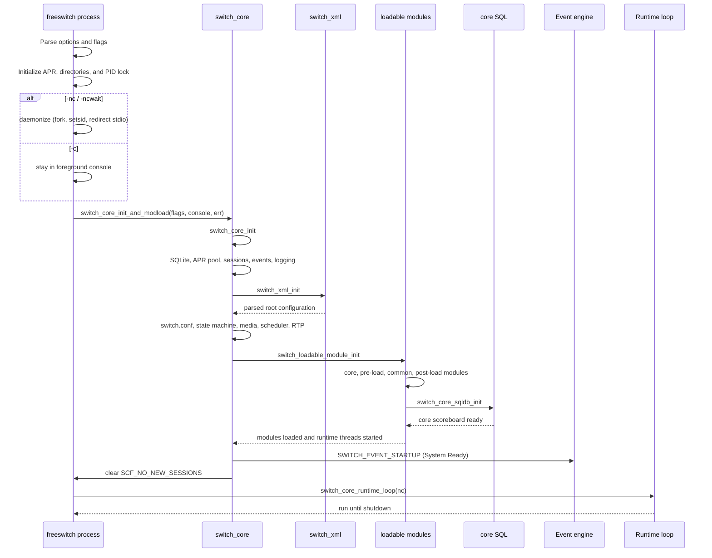
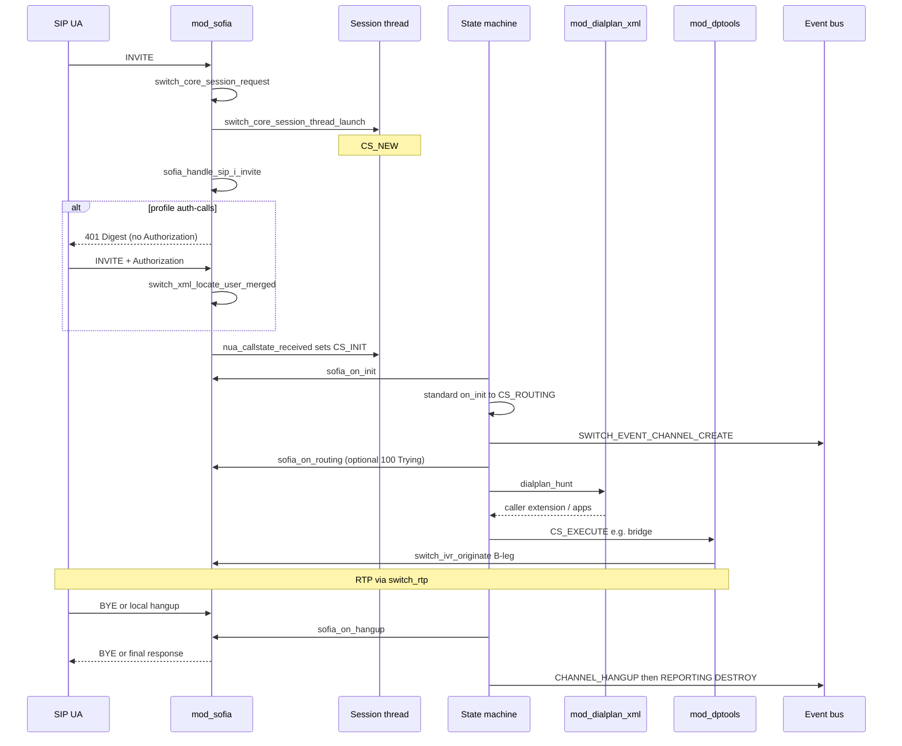
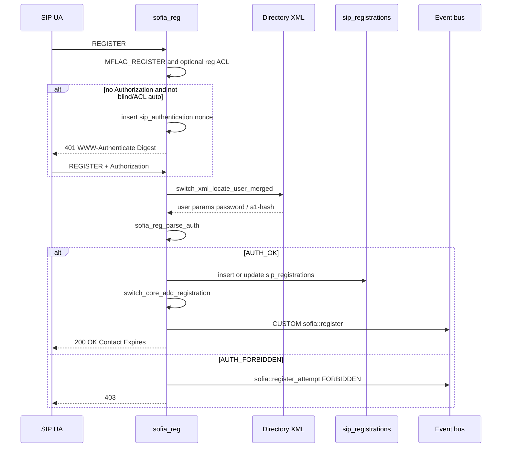
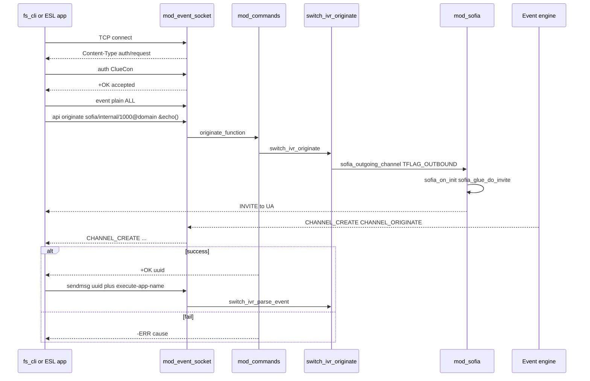
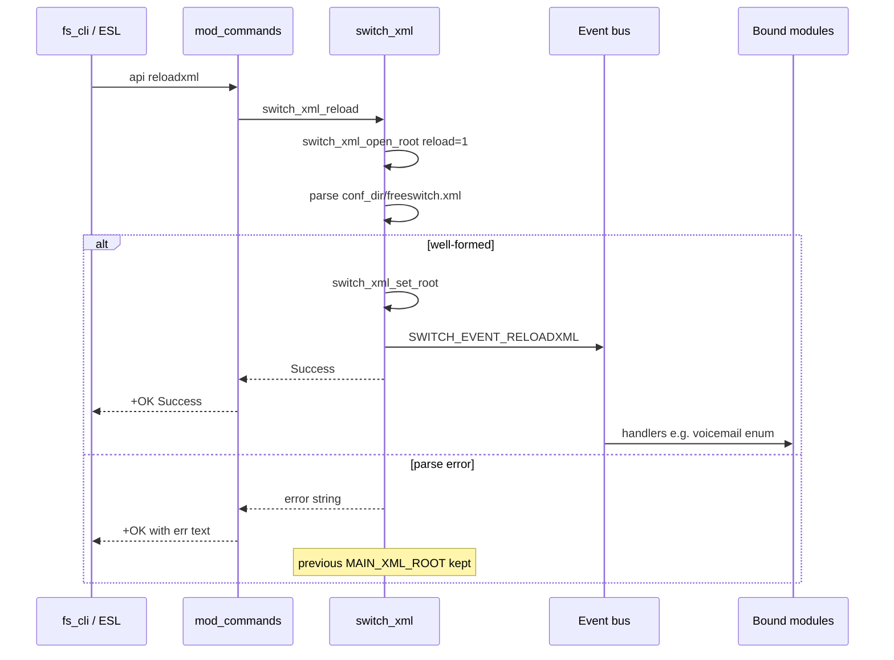

# 06. Workflows

<!-- maintained-by: human+ai -->

Critical **runtime** paths in this tree. Channel states (`CS_*`) and the state-handler contract are in [Architecture](02-architecture.md); ESL commands, events, and SQL tables are in [Data and API](05-data-and-api.md). Default inbound progression after create: `CS_NEW` → `CS_INIT` → `CS_ROUTING` → `CS_EXECUTE` → media or hangup `CS_HANGUP` → `CS_REPORTING` → `CS_DESTROY` (`src/include/switch_types.h`).

These flows use vanilla XML (`conf/vanilla/`). Other profiles (`conf/sbc`, `conf/minimal`, `conf/curl`) change bind ports, auth, and whether directory/dialplan come from files or `mod_xml_curl`. Operator-level walkthrough of the same 1000→1001 call: [Users Manual Chapter 1](https://developer.signalwire.com/freeswitch/foundations/introduction).

## Workflow Index

1. [Server startup](#server-startup)
2. [Inbound SIP call](#inbound-sip-call)
3. [SIP registration and directory lookup](#sip-registration-and-directory-lookup)
4. [ESL originate and event control](#esl-originate-and-event-control)
5. [XML reload](#xml-reload)

Vanilla 1000 calling 1001 (config files, not C): REGISTER on `sip_profiles/internal.xml` → directory `directory/default/1000.xml` (`user_context=default`) → INVITE `1001` → `dialplan/default.xml` `Local_Extension` → `bridge` `user/${dialed_extension}@${domain_name}`. Internal profile `context` is `public`; that value applies only to **unauthenticated** inbound. Late codec negotiation: `inbound-late-negotiation=true` on the internal profile.

---

## Server Startup

### Trigger and Goal

- **Trigger**: execute `freeswitch` with command-line options. The common local command is `freeswitch -ncwait -nonat`; `-ncwait` backgrounds the process and waits for the child to report readiness, while `-nonat` disables automatic NAT detection.
- **Goal**: establish process and runtime state, create the configured directories and PID lock, initialize the core services, load XML configuration and modules, announce `SWITCH_EVENT_STARTUP`, then remain in the console or background runtime loop until shutdown.

### Main Flow



### Key Steps

1. **Parse process options.** `main()` starts with core flags for SQL scoreboard, automatic NAT detection / port mapping, clock calibration, and realtime clock. Options such as `-nosql`, `-nonat`, `-nonatmap`, `-nc`, `-ncwait`, `-c`, `-conf`, `-log`, `-run`, and `-mod` modify those flags or global directories. `FREESWITCH_OPTS` is appended to the command-line arguments before parsing.
2. **Initialize the process runtime.** APR is initialized before the core. `switch_core_set_globals()` resolves the base, configuration, module, log, run, database, and related directories. The process creates or locks `${run_dir}/freeswitch.pid`; a second process using the same run directory exits instead of starting a duplicate server.
3. **Choose foreground or background mode.** `-c` passes `console=true` and enters the interactive console loop. `-nc` backgrounds without waiting. `-ncwait` backgrounds and uses a pipe so the parent waits until initialization succeeds or fails. `-nonat` removes `SCF_USE_AUTO_NAT`; it does not disable SIP or RTP.
4. **Apply process controls.** Signal handlers are installed for shutdown, optional priority is selected (`-rp`, `-lp`, or `-np`), resource limits are set, and `-u` / `-g` can drop to the requested user and group before core initialization.
5. **Initialize the core.** `switch_core_init()` resets runtime state, initializes SQLite, APR-backed memory pools, core session structures, global events, MIME types, console, event engine, and channel globals. It creates the configured directories and sets global variables such as `conf_dir`, `log_dir`, `run_dir`, and `mod_dir`.
6. **Load the root configuration.** `switch_xml_init()` parses the configured `freeswitch.xml` and its preprocessor includes. Unless `SCF_MINIMAL` is set, `switch_core_init()` then loads `switch.conf`, initializes the state machine and media layer, starts the scheduler task thread, performs late NAT initialization, initializes RTP, and schedules heartbeat / IP-check tasks.
7. **Load modules in dependency order.** `switch_loadable_module_init()` first prepares the module registries and loads core modules. It then reads `pre_load_modules.conf.xml`, starts the core SQL scoreboard, releases module-load events held until SQL is ready, reads `modules.conf.xml` and `post_load_modules.conf.xml`, and finally starts module runtime threads. A `critical="true"` module failure aborts startup.
8. **Publish readiness.** `switch_core_init_and_modload()` logs `Bringing up environment.` and `Loading Modules.`, fires `SWITCH_EVENT_STARTUP` with `Event-Info: System Ready`, prints the banner and startup summary, executes the optional `api_on_startup` command, and clears `SCF_NO_NEW_SESSIONS`. With systemd support it also sends `READY=1`.
9. **Enter the runtime loop.** `switch_core_runtime_loop(nc)` waits on `runtime.running` in background mode or reads console input in foreground mode. `-ncwait` reports readiness to its parent only after the initialization function returns successfully.
10. **Shutdown and cleanup.** SIGTERM / console shutdown leaves the runtime loop, calls `switch_core_destroy()`, marks the runtime as shutting down, rejects new sessions, hangs up existing sessions, shuts down modules and event / XML / RTP services, closes the PID file, removes it, and optionally re-execs when the result is `SWITCH_STATUS_RESTART`.

### Startup Output and Checks

Typical console output includes:

```text
Bringing up environment.
Loading Modules.
FreeSWITCH Started
```

For a background install, readiness should be checked through ESL after the process starts:

```bash
"$HOME/fs/bin/freeswitch" -ncwait -nonat
"$HOME/fs/bin/fs_cli" -x status
```

`fs_cli -x status` should print a line beginning with `UP`. `-ncwait` only means the parent waits for the child initialization handshake; it does not replace an application-level health check.

### Error and Edge Cases

| Case | Where handled | Expected outcome |
|------|---------------|------------------|
| Existing or locked PID file | `main` / `switch_file_lock` | Startup stops; the old PID content is preserved in the failure path |
| Invalid command-line option | `main` | Error text and non-zero exit |
| Missing XML root or malformed configuration | `switch_xml_init` / `switch_xml_open_root` | Initialization fails unless `SCF_MINIMAL` permits missing configuration |
| Core SQL unavailable | `switch_core_sqldb_init` | Module loading is interrupted and startup fails |
| Critical module cannot load | `switch_loadable_module_init` | Logs a critical error and calls `abort()` |
| Non-critical module cannot load | `switch_loadable_module_init` | Logs the module error and continues loading other modules |
| `-ncwait` child initialization failure | `daemonize` pipe handshake | Parent reports `Error starting system!` and exits after terminating the child |
| SIGTERM | `handle_SIGTERM` / `handle_SIGILL` | Requests elegant or immediate core shutdown, depending on `-elegant-term` |
| Restart requested by a module / API | `switch_core_destroy` → `main` | PID file is removed and the process re-execs, with a fork/system fallback |

### Data and Contracts Involved

- Global directory structure: `SWITCH_GLOBAL_dirs` and `${run_dir}/freeswitch.pid`.
- Runtime flags: `SCF_USE_SQL`, `SCF_USE_AUTO_NAT`, `SCF_USE_NAT_MAPPING`, `SCF_NO_NEW_SESSIONS`, and `SCF_SHUTTING_DOWN`.
- XML configuration layers: `freeswitch.xml`, `switch.conf`, `pre_load_modules.conf.xml`, `modules.conf.xml`, `post_load_modules.conf.xml`.
- Startup event: `SWITCH_EVENT_STARTUP` with `Event-Info: System Ready`.
- Readiness state: `runtime.running` and the `-ncwait` parent/child pipe handshake.

### Code References

- `src/switch.c` — `main`, option parsing, daemonization, PID file, signal handling, runtime loop
- `src/switch_core.c` — `switch_core_init`, `switch_core_init_and_modload`, `switch_core_runtime_loop`, `switch_core_destroy`
- `src/switch_loadable_module.c` — `switch_loadable_module_init`, preload/common/postload module ordering, runtime threads
- `src/switch_xml.c` — XML root initialization and reload primitives
- `src/switch_core_sqldb.c` — core SQL scoreboard initialization and shutdown
- `conf/vanilla/freeswitch.xml` — default configuration root and included sections
- `conf/vanilla/autoload_configs/modules.conf.xml` — runtime module load list

---

## Inbound SIP Call

### Trigger and Goal

- **Trigger**: SIP `INVITE` arrives on a Sofia profile (vanilla internal typically UDP/TCP **5060**, external **5080**). Sofia-SIP delivers `nua_i_invite` to `sofia_event_callback()` in `src/mod/endpoints/mod_sofia/sofia.c`.
- **Goal**: allocate a session/channel, authenticate if the profile requires it, hunt an XML extension, run applications (vanilla `Local_Extension` bridges `user/${dialed_extension}@${domain_name}`), exchange media, then hang up with a SIP response/`BYE`/`CANCEL` and CDR/events.

### Main Flow



### Key Steps

1. **Admit the INVITE.** `sofia_event_callback()` rejects with **503** `"Maximum Calls In Progress"` / `"System Busy"` / `"System Paused"` when session limit, message-queue critical watermark, or `PFLAG_STANDBY` is hit. Missing `Call-ID` → **503** `"INVALID INVITE"`. Session-timer `Min-SE` too small → **422**.
2. **Create the inbound session.** `switch_core_session_request()` (or `switch_core_session_request_uuid()` when `PFLAG_CALLID_AS_UUID`) plus `sofia_glue_new_pvt()` / `sofia_glue_attach_private()`. The event is queued onto the session with `switch_core_session_queue_signal_data()`; the session thread starts in `CS_NEW`.
3. **Handle the INVITE body.** `sofia_handle_sip_i_invite()` requires a `Contact` (**400** `"Missing Contact Header"` otherwise). Source IP/port become `sip_network_ip` / `sip_network_port`. Destination number is Request-URI user (`req_user`), or the full URI when `full-id-in-dialplan` (`PFLAG_FULL_ID`).
4. **Authenticate when required.** Vanilla internal profile: `auth-calls=$${internal_auth_calls}` (`true` in `conf/vanilla/vars.xml`) and `apply-inbound-acl` = `domains`. Failed ACL can fall back to Digest. Digest uses the same `sofia_reg_handle_register(..., REG_INVITE, ...)` path as REGISTER. Success sets `sip_authorized=true` and loads directory XML via `switch_ivr_set_user_xml()` (including `user_context`). External profile: `auth-calls=false` — typically no digest; context stays the profile context (`public`).
5. **Build the caller profile.** Context order in `sofia_handle_sip_i_invite()`: ACL override → channel `user_context` → profile `context` (or From-host when profile context is `_domain_`). Dialplan defaults to profile `dialplan` (`XML`) unless `inbound_dialplan` is set.
6. **Leave `CS_NEW`.** `sofia_handle_sip_i_state()` on `nua_callstate_received` sets `CS_INIT` after SDP offer handling (`sofia_media_negotiate_sdp` unless proxy/late-neg). `STATE_MACRO(init)` runs `sofia_on_init` then, if the endpoint returns `SWITCH_STATUS_SUCCESS`, `switch_core_standard_on_init()` (moves to `CS_ROUTING`, or `CS_EXECUTE` when `CF_RECOVERING`). After that macro, the `CS_INIT` case fires `SWITCH_EVENT_CHANNEL_CREATE`.
7. **Optional 100 Trying.** `sofia_on_routing()` sends `SIP_100_TRYING` when `PFLAG_AUTO_INVITE_100` and the inbound channel is not yet answered (`sofia_acknowledge_call()`).
8. **Hunt the dialplan.** `switch_core_standard_on_routing()` looks up `caller_profile->dialplan` (comma-separated names) and calls `hunt_function`. `mod_dialplan_xml` registers name `"XML"` → `dialplan_hunt()`. Hunt locates `<context name="...">` (fallback `global`), walks `<extension>` / `<condition>` regexes (`parse_exten`). Vanilla authenticated users (`user_context=default`) match `Local_Extension` `^(10[01][0-9])$` in `conf/vanilla/dialplan/default.xml`.
9. **Execute applications.** `switch_core_standard_on_execute()` walks `extension->current_application` and `switch_core_session_execute_application()`. Vanilla `Local_Extension` sets `hangup_after_bridge=true` / `continue_on_fail=true`, then `bridge` `user/${dialed_extension}@${domain_name}`. `audio_bridge_function()` calls `switch_ivr_originate()` for the B-leg, then `switch_ivr_multi_threaded_bridge()` (or `switch_ivr_signal_bridge()` when `CF_PROXY_MODE`). Failed originate can fall through to voicemail via `loopback/app=voicemail:...`.
10. **Hang up.** `switch_channel_hangup()` fires `SWITCH_EVENT_CHANNEL_HANGUP` (`src/switch_channel.c`). Session thread `CS_HANGUP` → `sofia_on_hangup()`: answered → `nua_bye`; unanswered outbound → `nua_cancel`; unanswered inbound → `nua_respond` with `hangup_cause_to_sip()`. Then `CS_REPORTING` → `CS_DESTROY`. Vanilla CDR is `mod_cdr_csv`, not core SQL.

### Error and Edge Cases

| Case | Where handled | Expected outcome |
|------|---------------|------------------|
| Session limit / queue overload / standby | `sofia_event_callback` | SIP **503** with `Retry-After: 300` (busy/max); standby has no Retry-After |
| No Contact | `sofia_handle_sip_i_invite` | SIP **400** `"Missing Contact Header"`; `ib_failed_calls++` |
| Auth required, no credentials | `sofia_reg_handle_register` / `sofia_reg_auth_challenge` | SIP **401** with `WWW-Authenticate` Digest; nonce stored in `sip_authentication` |
| Bad digest / unknown user | `sofia_reg_parse_auth` | `AUTH_FORBIDDEN` → **403** (or **401** if not marked forbidden); log `"Can't find user [user@domain]"` |
| ACL reject with `auth-calls-acl-only` | `sofia_handle_sip_i_invite` | SIP **403**; no digest fallback |
| No matching extension | `switch_core_standard_on_routing` | Hangup `SWITCH_CAUSE_NO_ROUTE_DESTINATION` |
| Codec mismatch on offer | `sofia_media_negotiate_sdp` / `nua_callstate_received` | SIP **488** if already past `CS_NEW` |
| `bridge` originate fails | `audio_bridge_function` | Logs `"Originate Failed"`; vanilla `continue_on_fail=true` continues to voicemail loopback |
| Recovered channel (`CF_RECOVERING`) | `switch_core_standard_on_init` | Skips `CS_ROUTING`; goes to `CS_EXECUTE` |
| Proxy media (`CF_PROXY_MODE` / `CF_PROXY_MEDIA`) | `sofia_on_init`, bridge | SDP absorbed; `switch_ivr_signal_bridge` instead of RTP bridge |
| Re-INVITE while both legs reinvite | `nua_callstate_received` | **491** Request Pending; redo outbound invite |

### Data and Contracts Involved

- Channel / session UUID; `switch_caller_profile_t` (`destination_number`, `context`, `dialplan`).
- Directory user XML after auth (`id`, `password`, `user_context`) — vanilla `conf/vanilla/directory/default/1000.xml`.
- Dialplan XML: `conf/vanilla/dialplan/default.xml` (`Local_Extension`), `conf/vanilla/dialplan/public.xml` for unauthenticated/external.
- Events: `SWITCH_EVENT_CHANNEL_CREATE`, `CHANNEL_STATE`, `CHANNEL_EXECUTE` / `_COMPLETE`, `CHANNEL_BRIDGE` / `_UNBRIDGE`, `CHANNEL_HANGUP` / `_HANGUP_COMPLETE`, outbound B-leg also `CHANNEL_ORIGINATE`.
- Core SQL `channels` / `calls` are a scoreboard projection, not the source of truth.
- SIP hangup mapping: `hangup_cause_to_sip()` in `mod_sofia.c`; optional Q.850 `Reason` unless `disable_q850_reason`.

### Code References

- `src/mod/endpoints/mod_sofia/sofia.c` — `sofia_event_callback`, `sofia_handle_sip_i_invite`, `sofia_handle_sip_i_state`
- `src/mod/endpoints/mod_sofia/mod_sofia.c` — `sofia_on_init`, `sofia_on_routing`, `sofia_on_execute`, `sofia_on_hangup`, `sofia_outgoing_channel`, `sofia_acknowledge_call`
- `src/mod/endpoints/mod_sofia/sofia_glue.c` — `sofia_glue_do_invite`, `sofia_glue_new_pvt`
- `src/switch_core_session.c` — `switch_core_session_request`, `switch_core_session_thread_launch`
- `src/switch_core_state_machine.c` — `STATE_MACRO`, `switch_core_standard_on_routing`, `switch_core_standard_on_execute`
- `src/mod/dialplans/mod_dialplan_xml/mod_dialplan_xml.c` — `dialplan_hunt`
- `src/mod/applications/mod_dptools/mod_dptools.c` — `audio_bridge_function` (`bridge`)
- `src/switch_ivr_originate.c` — `switch_ivr_originate`
- `src/switch_ivr_bridge.c` — media / signal bridge
- `conf/vanilla/sip_profiles/internal.xml`, `conf/vanilla/sip_profiles/external.xml`
- `conf/vanilla/dialplan/default.xml`

---

## SIP Registration and Directory Lookup

### Trigger and Goal

- **Trigger**: SIP `REGISTER` on a Sofia profile (`nua_i_register` → `sofia_reg_handle_sip_i_register()` in `src/mod/endpoints/mod_sofia/sofia_reg.c`). Directory lookup is also used for INVITE digest (`REG_INVITE`) and Verto login.
- **Goal**: locate `user@domain` in the XML `directory` section, complete Digest (unless ACL/blind-reg), persist the Contact in Sofia `sip_registrations` and core `registrations`, answer **200 OK**, fire `CUSTOM sofia::register`.

Vanilla directory: domain `$${domain}` in `conf/vanilla/directory/default.xml`, users `1000`–`1019` under `conf/vanilla/directory/default/*.xml`. Password is `$${default_password}`. Domain for REGISTER is the To/From host unless the profile sets `reg-domain`.

### Main Flow



### Key Steps

1. **Profile gates.** If the profile lacks `MFLAG_REGISTER`, respond **403**. Optional `apply-register-acl`: reject IP → **403**; pass without `PFLAG_BLIND_REG` → `REG_AUTO_REGISTER` (skip digest). Vanilla internal has `apply-register-acl` commented out.
2. **Missing Contact.** With `reg_deny_binding_fetch_and_no_lookup`, no Contact → **400**. Otherwise a fetch-style REGISTER may proceed without adding a binding.
3. **Challenge.** No `Authorization` (and not auto/blind) → `sofia_reg_auth_challenge()` inserts a nonce into `sip_authentication` and sends **401** `Digest realm=..., nonce=..., algorithm=MD5, qop="auth"` (RFC 8760 extra algorithms when configured).
4. **Locate the user.** `sofia_reg_parse_auth()` calls `switch_xml_locate_user_merged("id", username, domain_name, ip, ...)`. Domain is `profile->reg_domain` if set, else Digest realm. Pointer users (`type="pointer"` in group XML) cannot register. Missing user → `AUTH_FORBIDDEN` and the log line that the domain/user must exist in directory.
5. **Verify Digest.** Directory `<param name="password">` or `a1-hash`. `sip-forbid-register=true` forbids. Per-user `auth-acl` can still reject the source IP. Results: `AUTH_OK`, `AUTH_RENEWED`, `AUTH_STALE` (re-challenge), `AUTH_FORBIDDEN`.
6. **Store the binding.** `insert into sip_registrations` (or `update` on refresh) in `sofia_reg.c`; `switch_core_add_registration()` writes the core `registrations` table. Expires 0 deletes (`switch_core_del_registration`) and fires `CUSTOM sofia::unregister`.
7. **Respond and notify.** **200 OK** with Contact list from positive-expires bindings. Fire `CUSTOM sofia::register` (`MY_EVENT_REGISTER`). Attempts also fire `sofia::register_attempt` with `auth-result` `SUCCESS` / `RENEWED` / `STALE` / `FORBIDDEN`.
8. **INVITE reuse.** Inbound INVITE with `PFLAG_AUTH_CALLS` calls the same `sofia_reg_handle_register(..., REG_INVITE, ...)` using `Proxy-Authorization` / `Authorization`, then copies directory variables onto the channel.

### Error and Edge Cases

| Case | Where handled | Expected outcome |
|------|---------------|------------------|
| Profile not accepting REGISTER | `sofia_reg_handle_sip_i_register` | SIP **403** |
| Register ACL miss | `reg_acl` loop | SIP **403**; log `"IP … Rejected by register acl"` |
| Incomplete To/From | `sofia_reg_handle_register_token` | SIP **401**; log cannot authorize without complete header |
| Unknown user / pointer user | `sofia_reg_parse_auth` | `AUTH_FORBIDDEN` → **403** |
| Stale nonce | `AUTH_STALE` | New **401** with `stale=true` |
| `Expires: 0` | unregister branch | Delete rows; `sofia::unregister`; **200** |
| NAT / WS / TLS | via / Contact / `nat-acl` | Status text e.g. `Registered(WS-NAT)`; Contact rewritten toward received address |
| `mod_xml_curl` directory | `switch_xml_locate_user` open-root hook | Same locate API; HTTP/LDAP backend is operator config — **[NEEDS INPUT: whether this deploy uses file XML or curl/LDAP]** |
| `cacheable` user XML | `switch_xml_locate_user_merged` | Cached user can survive `reloadxml` until TTL; vanilla demo users have no `cacheable` attr |

### Data and Contracts Involved

- XML directory section; vanilla users `1000`–`1019`, groups `sales` / `billing` / `support` as pointers.
- Sofia tables (`sofia_glue.c`): `sip_registrations`, `sip_authentication`, `sip_dialogs`, `sip_presence`, `sip_subscriptions`.
- Core table `registrations` (`switch_core_add_registration` in `src/switch_core_sqldb.c`).
- Events: `CUSTOM sofia::register`, `sofia::register_attempt`, `sofia::register_failure`, `sofia::unregister` (`MY_EVENT_*` in `mod_sofia.h`).
- Channel vars after INVITE auth: `sip_authorized`, directory `<variables>` (e.g. `user_context=default`).

### Code References

- `src/mod/endpoints/mod_sofia/sofia_reg.c` — `sofia_reg_handle_sip_i_register`, `sofia_reg_handle_register_token`, `sofia_reg_parse_auth`, `sofia_reg_auth_challenge`
- `src/mod/endpoints/mod_sofia/sofia.c` — `nua_i_register` dispatch; INVITE `REG_INVITE`
- `src/switch_xml.c` — `switch_xml_locate_user_merged`, `switch_xml_locate_user`
- `src/mod/endpoints/mod_sofia/sofia_glue.c` — `CREATE TABLE sip_registrations`
- `conf/vanilla/directory/default.xml`, `conf/vanilla/directory/default/1000.xml`
- `conf/vanilla/sip_profiles/internal.xml` (`auth-calls`, commented `apply-register-acl`)

---

## ESL Originate and Event Control

### Trigger and Goal

- **Trigger**: TCP client (`fs_cli` or custom `libs/esl`) connects to `mod_event_socket`. Vanilla listen: port **8021**, password **`ClueCon`**, `listen-ip` **`::`** in `conf/vanilla/autoload_configs/event_socket.conf.xml`. `fs_cli` itself defaults to **`127.0.0.1:8021`** / `ClueCon` (`libs/esl/fs_cli.c`).
- **Goal**: authenticate, then run console APIs (`api` / `bgapi`, including `originate`), subscribe to events, and/or drive a live UUID with `sendmsg` (`call-command: execute|hangup|…`). Outbound mode: dialplan app `socket` connects **from** FreeSWITCH to a controller.

For production, bind ESL to loopback or a trusted management network, enable
an inbound ACL, and replace `ClueCon`; the vanilla `listen-ip` is `::`
(wildcard IPv6, with IPv4 behavior dependent on the host socket settings).
**[NEEDS INPUT: site ESL bind and password]**.

### Main Flow



### Key Steps

1. **Accept and challenge.** Listener thread sends `Content-Type: auth/request`. Until `LFLAG_AUTHED`, only `auth <password>` (compared to `prefs.password`) or `userauth user@domain:pass` (directory `esl-password` / `esl-allowed-api` / `esl-allowed-events`) are accepted. Wrong password: `-ERR invalid` and the socket is closed.
2. **Parse commands.** `parse_command()` in `mod_event_socket.c`. After auth: `api`, `bgapi` (async + `Job-UUID` + `BACKGROUND_JOB`), `event` / `nixevent` / `noevents` / `myevents`, `sendmsg`, `sendevent`, `getvar`, `log`, `linger`, `exit` (`+OK bye`). Replies are `+OK` or `-ERR`.
3. **`api originate`.** `originate_function` in `mod_commands.c`. Syntax: `<call url> <exten>|&<application_name>(<app_args>) [<dialplan>] [<context>] [<cid_name>] [<cid_num>] [<timeout_sec>]`. Defaults: dialplan `XML`, context `default`, timeout **60s**. Calls `switch_ivr_originate()`. On success the new session is transferred into the extension or `&app(args)` inline extension; on failure `-ERR` plus `switch_channel_cause2str(cause)`.
4. **Outbound SIP leg.** `sofia_outgoing_channel()` sets `TFLAG_OUTBOUND` and `CS_INIT`. `sofia_on_init()` then `sofia_glue_do_invite()` sends the INVITE. Core also fires `SWITCH_EVENT_CHANNEL_ORIGINATE` for outbound legs.
5. **`sendmsg`.** Headers include `call-command`. `switch_ivr_parse_event()` hashes `execute` (needs `execute-app-name` / `execute-app-arg`), `hangup`, `nomedia`, `unicast`, `xferext`. With a UUID, the event is queued on that session (`switch_core_session_queue_private_event`); outbound `socket` sessions may run it inline.
6. **Outbound ESL (`socket` app).** `SWITCH_ADD_APP(..., "socket", ..., socket_function, "<ip>[:<port>]")`. The channel connects out; the controller sends the same `sendmsg` vocabulary. `LFLAG_OUTBOUND` without `LFLAG_FULL` skips inbound-only commands (`api`, `sendevent`, …).
7. **Events to the client.** `mod_event_socket` binds `SWITCH_EVENT_ALL`. Serialize with `switch_event_serialize()` (plain) or JSON. Do not block the event thread (`switch_event.h`).

`bgapi` is the non-blocking form of `api`; `originate` itself can block up to the timeout (the API logs a notice if invoked on an existing session).

### Error and Edge Cases

| Case | Where handled | Expected outcome |
|------|---------------|------------------|
| Bad ESL password | `parse_command` auth | `-ERR invalid`; connection dropped |
| Command before auth | `LFLAG_AUTHED` check | Ignored except `auth` / `userauth` |
| `userauth` API not in allow-list | `auth_api_command` | `-ERR permission denied` |
| `originate` argc not 2–7 | `originate_function` | `-USAGE:` plus `ORIGINATE_SYNTAX` |
| Originate timeout / SIP fail | `switch_ivr_originate` | `-ERR` cause string (`NO_ANSWER`, `USER_BUSY`, …) |
| `sendmsg` unknown UUID | `parse_command` | `-ERR invalid session id [… ]` |
| Missing `call-command` | `switch_ivr_parse_event` | Log `"Invalid Command!"`; `SWITCH_STATUS_FALSE` |
| Unload/reload `mod_event_socket` via `api` | cheat rewrite | Forced to `bgapi` so the listener thread is not torn down mid-command |
| Slow ESL consumer | event delivery thread | Core warns; client must queue locally |

### Data and Contracts Involved

- ESL line protocol after `auth` (see [Data and API](05-data-and-api.md) command table).
- Console APIs: `originate`, `uuid_kill`, `uuid_bridge`, `uuid_transfer`, `status`, `show channels` (`mod_commands.c`).
- Events as subscribed; `BACKGROUND_JOB` for `bgapi`.
- Channel UUID returned on successful originate — handle for later `sendmsg` / `uuid_*`.

### Code References

- `src/mod/event_handlers/mod_event_socket/mod_event_socket.c` — `parse_command`, `LFLAG_AUTHED`, `socket_function`
- `libs/esl/src/esl.c` — `esl_connect_timeout`, `esl_send_recv`
- `libs/esl/fs_cli.c` — default host/port/password; `-x` one-shot (`fs_cli -x status`)
- `src/mod/applications/mod_commands/mod_commands.c` — `originate_function`, `ORIGINATE_SYNTAX`
- `src/include/switch_ivr.h` / `src/switch_ivr_originate.c` — `switch_ivr_originate`
- `src/switch_ivr.c` — `switch_ivr_parse_event` (`call-command`)
- `src/switch_event.c` — bus, `switch_event_serialize`
- `conf/vanilla/autoload_configs/event_socket.conf.xml`

---

## XML Reload

### Trigger and Goal

- **Trigger**: console/ESL `reloadxml` (`reload_xml_function` in `mod_commands.c`), or `reloadacl` / `sofia profile <name> rescan` which also call `switch_xml_reload()`.
- **Goal**: re-parse `conf_dir` + `freeswitch.xml` (vanilla root `conf/vanilla/freeswitch.xml` with preprocessor includes), replace `MAIN_XML_ROOT`, fire `SWITCH_EVENT_RELOADXML` so **new** dialplan hunts and directory locates see the new tree. In-flight sessions keep the extension they already hunted.

### Main Flow



(`reload_xml_function` always prints `+OK [%s]` with the `err` string from `switch_xml_reload` — including failure text. Check the bracketed message, not only `+OK`.)

### Key Steps

1. **Re-open root.** `switch_xml_reload()` → `switch_xml_open_root(1, err)` → `__switch_xml_open_root()`. Path: `SWITCH_GLOBAL_dirs.conf_dir` + `SWITCH_GLOBAL_filenames.conf_name`. Preprocessor expands `X-PRE-PROCESS` / `#include` / `#set`. Flattened copy remains `freeswitch.xml.fsxml` (do not edit while running).
2. **Commit or keep old.** Parse error: `switch_xml_error()` copied to `err`, new tree discarded, previous root stays. Success: `switch_xml_set_root(new_main)`, `err` = `"Success"`.
3. **Notify.** If a root is returned, `SWITCH_EVENT_RELOADXML` is fired (`switch_xml_open_root`). Modules that `switch_event_bind(..., SWITCH_EVENT_RELOADXML, ...)` refresh themselves (examples in-tree: `mod_voicemail` does not bind this id for its main config in the same way; `mod_enum`, `mod_cidlookup`, `mod_loopback`, `mod_avmd`, `mod_tts_commandline` do).
4. **What picks up immediately.** Next `dialplan_hunt()` / `switch_xml_locate_user()` reads the new root. Vanilla file users without `cacheable` are re-read from XML.
5. **What does not auto-apply.** `mod_sofia` does **not** bind `SWITCH_EVENT_RELOADXML`. `sofia profile <name> rescan` reloads supported profile data and reparses gateways, domains, and aliases, but it does not rebind transport sockets. Changes to `sip-ip`, `sip-port`, TLS, `ws-binding`, or `wss-binding` require a profile restart or process restart. ACL lists: `reloadacl` reloads XML **and** `switch_load_network_lists(SWITCH_TRUE)`. Loaded DSOs: `reload <module>` is separate from XML.

`mod_xml_curl` (when enabled) may replace `__switch_xml_open_root` via `switch_xml_set_open_root_function()` — then “reload” is whatever that hook does (HTTP fetch). **[NEEDS INPUT: whether this deploy uses `mod_xml_curl` for live XML]**.

### Error and Edge Cases

| Case | Where handled | Expected outcome |
|------|---------------|------------------|
| Broken include / bad XML | `__switch_xml_open_root` | `err` set (e.g. parser message or `"Cannot Open log directory or XML Root!"`); old root kept |
| Success string vs API prefix | `reload_xml_function` | Stream is always `+OK [%s]\n` — inspect `%s` |
| In-call session | dialplan already hunted | Continues current extension; next transfer/new call uses new XML |
| `cacheable` directory users | `switch_xml_locate_user_merged` | Cache **not** cleared by `switch_xml_set_root`; stale user until TTL or `switch_xml_clear_user_cache` |
| Sofia bind/codec/gateway XML | `mod_sofia` (no RELOADXML bind) | Still running old profile until `sofia profile <name> rescan` / `restart` |
| ACL XML only | `reloadxml` alone | Network lists not rebuilt until `reloadacl` |
| `reloadacl reloadxml` extra arg | `reload_acl_function` | Deprecated notice; ACL path **always** reloads XML now |

### Data and Contracts Involved

- XML sections: `configuration`, `dialplan`, `directory`, `chatplan`, `languages` (`conf/vanilla/freeswitch.xml`).
- Event `SWITCH_EVENT_RELOADXML` (`switch_types.h`).
- Sofia CLI: `sofia profile <name> [start\|stop\|restart\|rescan]` (`mod_sofia.c`).

### Code References

- `src/mod/applications/mod_commands/mod_commands.c` — `reload_xml_function`, `reload_acl_function`
- `src/switch_xml.c` — `switch_xml_reload`, `switch_xml_open_root`, `__switch_xml_open_root`, `switch_xml_set_root`
- `src/mod/endpoints/mod_sofia/mod_sofia.c` — `sofia profile … rescan`
- `conf/vanilla/freeswitch.xml`

---

## Related Documentation

- [Architecture](02-architecture.md)
- [Data and API](05-data-and-api.md)
- [Testing](09-testing.md)
- [Runbook](10-runbook.md)
- [Users Manual Ch 1](https://developer.signalwire.com/freeswitch/foundations/introduction), [Ch 7 SIP profiles](https://developer.signalwire.com/freeswitch/users-and-endpoints/sip-profiles), [Ch 12 Dialplan](https://developer.signalwire.com/freeswitch/dialplan/xml)

---
<!-- PKB-metadata
last_updated: 2026-08-31
commit: ea429c9d49
updated_by: human+ai
review_status: pending
review_score: 0
reviewed_by:
confidentiality: L1
-->
